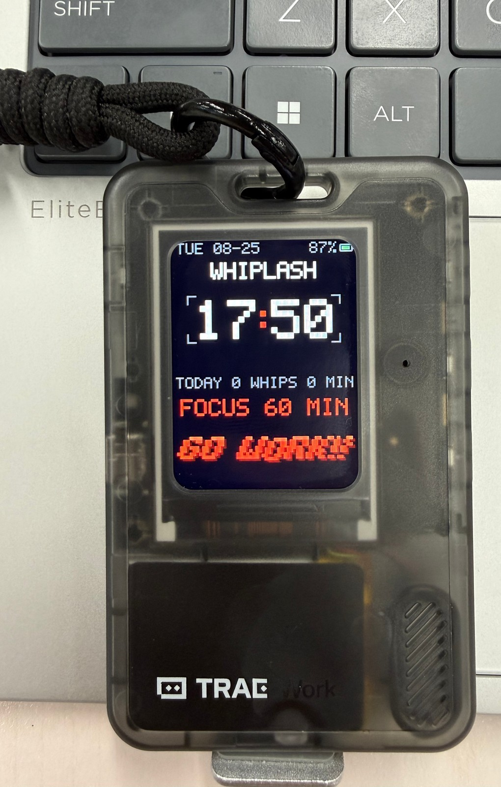
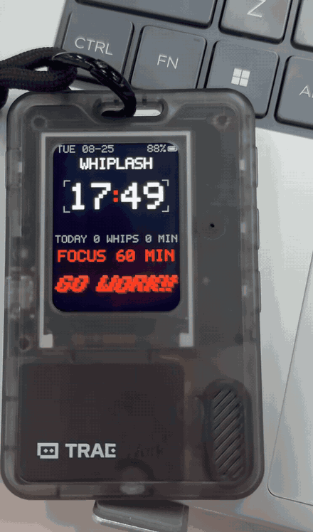
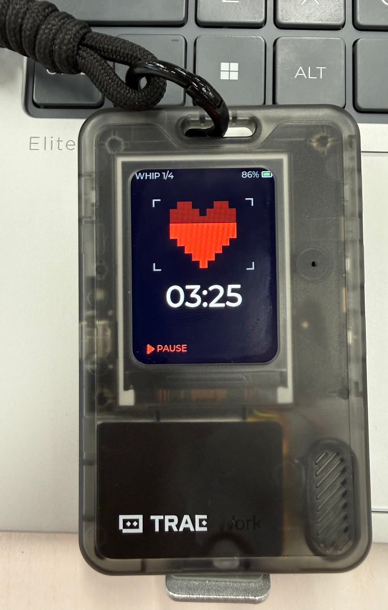
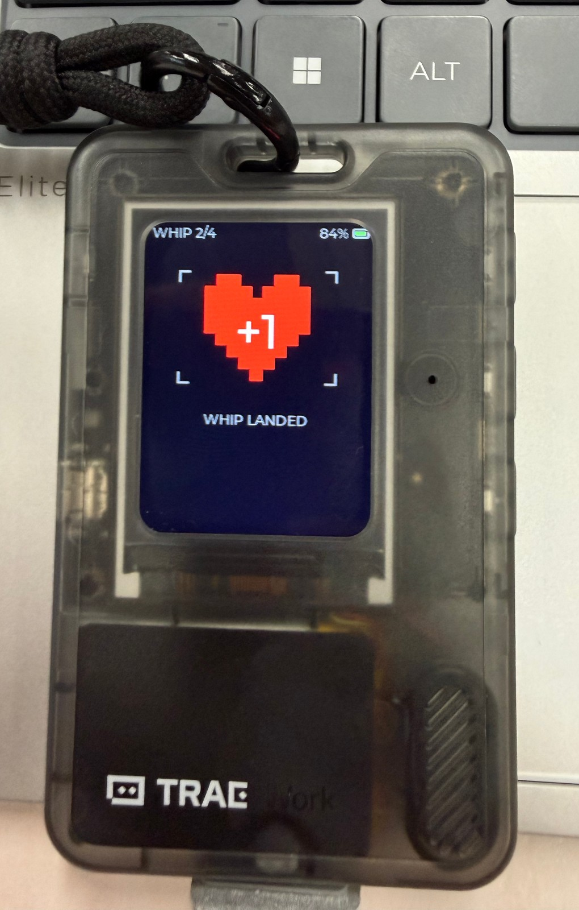

# WHIPLASH · GO WORK!!

[中文](README.md) | **English**

<p align="center">
  
</p>

> A brutal Pomodoro timer for the FoloToy AI Passport — finish a focus session, earn a whip.

<p align="center">
  
</p>

<p align="center"><sub>Real hardware. It sits completely still, then gets violently whipped every ~2 seconds.</sub></p>

WHIPLASH is a single-purpose Pomodoro firmware for the [FoloToy AI Passport](https://github.com/folotoy/ai-passport), a pocket-size ESP32-C3 device. It's built on the official BSP, with the stock pet-raising demo stripped out and replaced by exactly one job: timing your focus, boss-style. Pixel blood hearts, CRT-glitch captions, zero cloud.

## Why WHIPLASH?

Ordinary Pomodoro apps reward you with a gentle chime and a checkmark. WHIPLASH is not gentle. Finish a session and the screen takes a whip — violent displacement, CRT line-tear, red ghosting — then snaps back to dead silence until the next one. Turning "one more pomodoro" into something that fights back turns out to be weirdly effective.

## Real Hardware

Everything below is photographed on an actual device (FoloToy AI Passport · WHIPLASH v1.3.0). No mockups, no simulator captures:

| Focusing — the blood heart drains with the countdown | Session complete — whip landed |
| --- | --- |
|  |  |

> Want a look before flashing? [`docs/UI_PREVIEW.html`](docs/UI_PREVIEW.html) is an interactive browser approximation (simulated UI, not device captures). Everything on this page is real hardware.

## Features

- **Focus timer** — 9 presets (5/10/15/20/25/30/45/60/90 min, default 25); breaks map from focus length (5/10/15 min), and every 4th pomodoro doubles that break
- **Draining blood heart** — the heart bleeds out during focus and refills during breaks; it beats once a second and stops dead when you pause
- **GO WORK!! impact shake** — bold right-leaning pixel glyphs with a hard shadow, whipped every 2 s: 240 ms of violent motion (large displacement + 3-band CRT line tear + ±8 px red ghosting), then back to dead still; rendered on its own partial-refresh layer so the roar never slows the idle clock
- **Idle clock** — hand-drawn pixel digits, breathing colon, corner brackets; weekday/date, today's whip tally, summary line and current preset
- **Time sync** — SNTP over Wi-Fi in the background with a 6-hour resync window; offline it extrapolates from anchor + uptime, so the clock survives even with no RTC on board
- **SoftAP Wi-Fi setup** — no recompile needed: join `WHIPLASH-XXXX` from your phone, open `192.168.4.1`, enter your 2.4 GHz credentials; they're stored only in the device's NVS, no cloud involved
- **Statistics** — per-day pomodoro counts and minutes for the last 90 days (ring buffer) plus lifetime totals; the stats page shows a rolling 7-day bar chart
- **Battery** — CW2017 fuel-gauge readout on the idle screen
- **Power saving** — per-scene backlight tiers and screen-off timeouts (idle 120 s / break 30 s); any key wakes the display
- **Reliability** — a power cut resumes the session paused; a `reward_pending` flag means a blackout at the finish line never double-counts; NVS storage is versioned (v1 pet-era data is migrated and wiped automatically)

## Hardware

FoloToy AI Passport ([official site](https://ai-passport.folotoy.cn/)):

| Module | Part |
| --- | --- |
| MCU | ESP32-C3, 4 MB flash, no PSRAM, no RTC |
| Display | ST7789P3 240×320 SPI |
| Audio | ES8311 codec |
| Fuel gauge | CW2017 |
| Buttons | UP / DOWN / OK, three buttons on a shared ADC |

## Flash in 5 Minutes

1. Connect the device with a **USB data cable**
2. Open the official Web Flasher: <https://ai-passport.folotoy.cn/tools/web-flasher/>
3. Pick `USB JTAG/serial debug unit` as the serial port
4. Flash [`releases/whiplash-esp32c3-v1.3.0-merged.bin`](releases/whiplash-esp32c3-v1.3.0-merged.bin) — bootloader + partition table + app in one image, written from `0x0`
5. It reboots straight into WHIPLASH

> The prebuilt image ships with **empty Wi-Fi credentials** (offline mode, clock shows `--:--`). You don't need to compile anything to get real time — see [Wi-Fi Setup](#wi-fi-setup), two minutes with your phone.
>
> **Note:** merged.bin is a clean-install image. Writing it from `0x0` erases the NVS partition as well, so stats and saved Wi-Fi reset to zero. It is not a data-preserving upgrade path — and there is no OTA; flashing is over the cable.

## Wi-Fi Setup

Wi-Fi is **optional**. Without it the pomodoro works normally; the clock stays at `--:--` until the first sync, and after one successful sync the time keeps running offline.

### SoftAP provisioning (recommended, no recompile)

The prebuilt firmware contains no credentials at all. On first boot — no NVS config and no compile-time credentials — it enters setup mode by itself:

1. The idle screen shows a banner: `WIFI SETUP / CONNECT: WHIPLASH-XXXX / OPEN: 192.168.4.1 / OK: OFFLINE` (XXXX = last 4 hex digits of the MAC)
2. Join the `WHIPLASH-XXXX` hotspot from your phone (open network, exists only during the setup session)
3. Open `http://192.168.4.1`, type your home Wi-Fi SSID and password, hit **SAVE & CONNECT**
4. The device saves the credentials → switches to station mode → syncs time over SNTP → the clock goes real (banner shows `WIFI OK / TIME SYNCED`)

Details:

- **2.4 GHz only** — the ESP32-C3 has no 5 GHz radio; a 5 GHz SSID fails to connect (banner: `WIFI FAILED / HOLD DOWN FOR SETUP`)
- **Never blocks the timer** — press OK during the banner to dismiss it and keep working offline; only the clock waits
- **Auto power saving** — the AP closes itself after 5 minutes without a page hit; hold DOWN to bring it back
- **Re-provisioning** — hold **DOWN** on the idle screen to reopen setup; old credentials are only overwritten when a valid new SSID is submitted
- **Privacy** — credentials live only in the device's NVS, nothing is uploaded to any cloud, and the password is never echoed on the serial log or the setup page

### Compile-time credentials (developers)

`main/wifi_config.h` is **not tracked** (gitignored); the first build copies it from [`main/wifi_config.example.h`](main/wifi_config.example.h). Fill in up to two 2.4 GHz networks:

```c
#define POMO_WIFI_SSID_1 "your-ssid"
#define POMO_WIFI_PASS_1 "your-password"
#define POMO_WIFI_SSID_2 ""     // backup, may stay empty
#define POMO_WIFI_PASS_2 ""
```

Priority: **NVS user config > compile-time credentials**. End users go through SoftAP; developers can keep a fixed lab Wi-Fi (NVS wins once provisioned).

### Runtime behavior (both methods)

- On boot, credentials are tried in order (15 s timeout each); with none configured, the device runs fully offline
- NTP sources: `ntp.aliyun.com` and `pool.ntp.org`, timezone fixed at UTC+8
- After a successful sync the radio powers down and resyncs every 6 hours; failed connections retry every 30 minutes
- Networking is strictly optional: runtime failures are logged and retried, never abort or reboot-loop — the pomodoro core doesn't depend on it

> **Privacy reminder:** compile-time Wi-Fi credentials end up as plaintext strings inside the firmware binary. Don't distribute or commit self-built `.bin` files that contain real credentials; official releases always use empty compile-time credentials.

## Controls

| State | UP click | DOWN click | OK click | Double-click |
| --- | --- | --- | --- | --- |
| Screen off (any scene) | wake | wake | wake | wake |
| Idle | previous preset | next preset | start focus | UP = stats page, DOWN = mute |
| Focusing | – | – | pause | – |
| Focus paused | abandon | – | resume | – |
| Abandon confirm | confirm abandon | cancel | cancel | – |
| Break prompt | skip break | – | start break | – |
| On break | – | – | pause | – |
| Break paused | – | – | resume | – |
| Stats page | – | – | exit (auto-exits after 10 s) | – |

- A session only counts when the countdown runs out naturally; pausing doesn't affect the verdict; abandoned sessions are void
- Hold OK to save the session as paused and return to the BSP demo menu; hold **DOWN** on the idle screen for Wi-Fi setup (press OK during the banner to dismiss it and stay offline)
- A finished pomodoro plays a triple beep; double-click DOWN toggles mute

## Power / Screen Behavior

| Scene | Backlight profile |
| --- | --- |
| Idle / break prompt | 100% for 15 s → 10% until 120 s total → off |
| Focusing | 100% for 5 min → 50% indefinitely |
| Focus/break paused | 100% for 60 s → 10% indefinitely |
| On break | 100% for 10 s → 10% until 30 s total → off |
| Abandon confirm / reward animation / stats page | 100% |

## Build from Source

ESP-IDF 5.5.3:

```bash
idf.py set-target esp32c3
idf.py build
idf.py flash monitor
```

Or Docker, no local toolchain needed:

```bash
docker pull espressif/idf:v5.5.3
docker run --rm -v "$(pwd):/src" -v pomodoro-build:/work -w /work \
  espressif/idf:v5.5.3 bash /src/tools/docker_build.sh
```

Artifacts land in `build/` and `releases/`.

## Tests

Seven host-side suites run the pure logic without any ESP-IDF (model / calendar / stats / storage blob / pixel math / battery SOC readiness / Wi-Fi provisioning):

```bash
bash tests/run_all_tests.sh
```

Display, audio, battery and the physical buttons need on-device verification.

## Project Structure

```text
components/bsp/     board drivers (display/buttons/audio/battery) and public API
main/               app: pomodoro state machine, pixel UI, time sync, stats & storage
tests/              host-runnable pure-logic tests (no ESP-IDF needed)
docs/               PRD, tickets, UI preview page, hardware guide
tools/              Docker build scripts
```

Core modules: `pomodoro_model` (state machine), `pomodoro_time` (Wi-Fi + SNTP + offline extrapolation), `wifi_provision/wifi_prov_util` (SoftAP setup), `pomodoro_stats` (ring-buffer stats), `pomodoro_store/blob` (NVS persistence & version migration), `pomodoro_date` (calendar), `demo_pomodoro` (UI).

## Credits & License

- Derived from [folotoy/ai-passport](https://github.com/folotoy/ai-passport) (MIT License, Copyright (c) 2026 FoloToy); BSP drivers and hardware docs come from upstream
- Visual inspiration: *The Binding of Isaac* (blood hearts) and *Whiplash* (the movie). Inspiration only — no affiliation or endorsement
- WHIPLASH modifications by [aris659](https://github.com/aris659)
- [MIT License](LICENSE)
