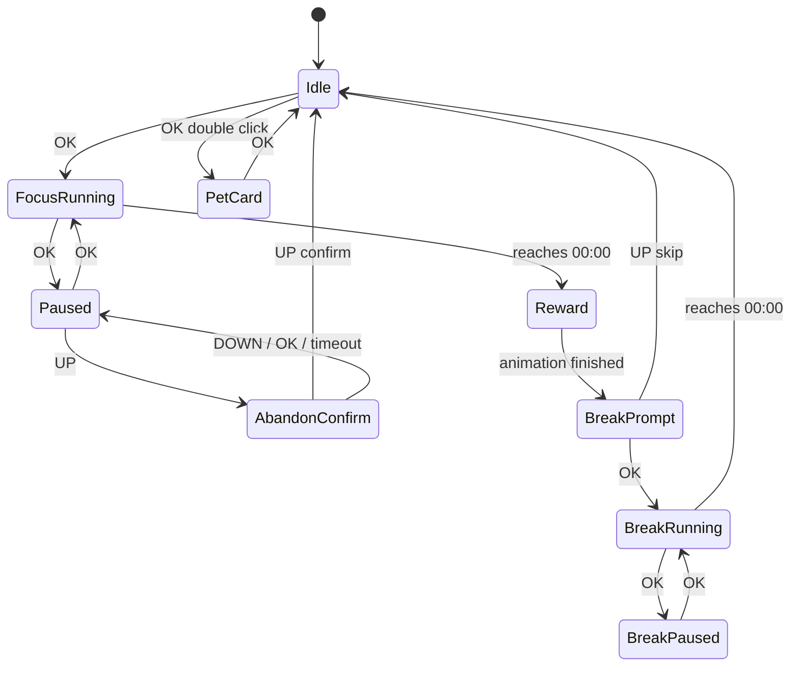

# 口袋猫咪番茄钟 PRD

> 文档状态：可进入固件设计与开发
> 产品载体：FoloToy-Card / ESP32-C3 / 240 × 320 LCD / 三枚 ADC 按键
> 目标分支：`demo/cat-themed-pomodoro-timer`
> PRD 版本：v1.0
> 更新日期：2026-08-12

## 1. 产品概述

### 1.1 产品名称

- 中文名：口袋猫咪番茄钟
- 英文 UI 名：`POCKET POMO`
- 内部功能名：`Cat-themed Pomodoro Timer`

### 1.2 产品定位

口袋猫咪番茄钟是一款运行在 FoloToy-Card 上的离线专注工具。用户完成一轮番茄专注后，屏幕中的猫咪获得成长值并产生即时反馈；连续完成专注可以让猫咪从幼猫逐步成长为专注伙伴。

产品把“开始一个计时器”转化为“照顾并陪伴一只猫成长”，用低打扰、可持续的正反馈帮助用户建立专注习惯。

### 1.3 核心价值

1. **低启动成本**：进入页面后按一次 `OK` 即可开始默认 25 分钟专注。
2. **完成才奖励**：只有完整完成专注才结算成长值，暂停、退出或放弃不会提前发奖。
3. **即时情感反馈**：每次完成都有猫咪动作、爱心、音效和成长条变化。
4. **无惩罚养成**：中断或多日未使用不会让猫咪退化，避免负反馈造成放弃。
5. **离线可靠**：不依赖手机、账号或网络，进度保存在设备本地。

## 2. 背景与设计输入

参考 UI 的主要视觉特征：

- 黑色背景与高对比像素美术；
- 页面中心为大型像素番茄；
- 番茄外围是环形倒计时和刻度；
- 中下部显示大号剩余时间；
- 底部使用状态文案、绿色进度条、猫咪和爱心形成养成反馈区；
- 顶部保留轻量状态栏和产品标题。

本 PRD 延续上述视觉方向，并根据实际硬件做以下调整：

- 当前硬件没有已确认的 RTC、联网校时或系统时间来源，因此 MVP 不显示类似 `10:28` 的绝对时间；左上角改为本轮专注序号，如 `FOCUS 2/4`。
- CW2017 可提供电池百分比；读取失败时显示 `--%`，不阻塞计时器。
- 硬件没有已确认的振动马达，因此完成提醒仅使用画面、背光和可选音效。
- ESP32-C3 没有 PSRAM，动画使用少量 LVGL 对象和小尺寸像素素材，不使用全屏多帧动画。

## 3. 目标与非目标

### 3.1 MVP 产品目标

- 用户能够在 3 秒内理解如何开始一轮 25 分钟专注。
- 用户可以开始、暂停、继续、放弃专注，并在断电后恢复未完成计时。
- 完成一轮有效专注后，猫咪准确获得一次成长值。
- 用户可以清楚看到当前猫咪阶段、距下一阶段的进度和累计完成量。
- 计时、成长与恢复逻辑在重复进入/退出页面后保持一致，不泄漏资源。

### 3.2 成功指标

设备端不采集云端行为数据，MVP 通过实机可观测指标验收：

- 完成一次计时的操作路径不超过 2 次按键：进入应用、按 `OK` 开始。
- 计时完成奖励重复发放率为 0。
- 正常完成奖励漏发率为 0。
- 25 分钟计时误差不超过 ±1 秒。
- 连续完成 20 轮短时工程测试后，页面无崩溃、看门狗、明显内存持续下降。
- 断电恢复、暂停恢复和退出重进均通过规定场景测试。

### 3.3 MVP 非目标

- 手机 App、账号、云同步或多人排行；
- 触摸操作、震动提醒、充电动画或充电控制；
- 基于日期的连续打卡、今日统计和日历热力图；
- 离线期间继续倒计时；
- 商店、货币、喂食、装扮和复杂道具体系；
- 精确的当前时间显示；
- 在应用内烧录或升级固件。

这些能力需要额外硬件信息、可靠时钟源、网络能力或更大的内容预算，不属于本版本。

## 4. 目标用户与使用场景

### 4.1 目标用户

- 需要短时专注辅助的学生、开发者和创作者；
- 喜欢像素宠物、希望通过轻量养成获得正反馈的用户；
- 不希望专注期间打开手机或被手机通知打扰的用户。

### 4.2 核心场景

1. 用户开始学习前进入番茄钟，按 `OK` 开始 25 分钟专注。
2. 用户临时被打断，按 `OK` 暂停，回来后再次按 `OK` 继续。
3. 用户完成一轮专注，猫咪庆祝并获得一个成长点，随后选择休息或开始下一轮。
4. 设备意外掉电，重新开机后未完成计时以暂停状态恢复，已经结算的奖励不会再次发放。
5. 用户查看底部成长条，感知距离下一成长阶段还需完成多少轮。

## 5. 产品闭环


闭环中最重要的产品规则是：**完成专注是成长值的唯一来源**。开始、暂停、恢复、进入休息或单纯停留在页面均不会增加成长值。

## 6. 信息架构

MVP 保持单主页面设计，避免在三按键设备上建立过深导航。

```text
FoloToy 主菜单
└── Pomodoro
    ├── Timer 主页面
    │   ├── Idle 待开始
    │   ├── Focus Running 专注中
    │   ├── Paused 已暂停
    │   ├── Reward 完成结算
    │   └── Break Prompt / Break Running 休息
    └── Pet Card 宠物卡片（Idle 状态双击 OK）
```

长按 `OK` 继续遵循项目全局规则，返回 FoloToy 主菜单。若计时正在进行，退出前自动保存并转为暂停；再次进入应用后恢复该轮计时。

## 7. 核心功能需求

### 7.1 专注时长

MVP 提供三个预设：

| 预设 | UI 文案 | 用途 |
| --- | --- | --- |
| 15 分钟 | `15 MIN` | 短任务 |
| 25 分钟 | `25 MIN` | 默认标准番茄 |
| 45 分钟 | `45 MIN` | 深度专注 |

规则：

- 首次使用默认 25 分钟；
- 仅在 `Idle` 状态可切换时长；
- `UP` 选择上一个预设，`DOWN` 选择下一个预设，循环切换；
- 当前选择保存在 NVS，下次启动沿用；
- 三个预设只要完整完成，都结算 1 个成长点；
- 开发/工厂测试构建可提供 10 秒调试时长，但发布构建不得暴露该选项。

### 7.2 开始、暂停与继续

- `Idle` 短按 `OK`：开始专注；
- `Focus Running` 短按 `OK`：暂停；
- `Paused` 短按 `OK`：继续；
- 状态切换的视觉反馈应在按键事件确认后 100 ms 内出现；
- 暂停期间剩余时间不减少；
- 暂停次数不限，不影响完成奖励。

### 7.3 放弃当前专注

为避免误操作，放弃采用二次确认：

1. 在 `Paused` 状态按 `UP`，进入 `ABANDON?` 确认态；
2. `UP` 确认放弃，`DOWN` 或 `OK` 取消；
3. 5 秒无操作自动取消确认；
4. 放弃后回到 `Idle`，不结算成长值，不计入累计专注分钟；
5. 当前四轮循环进度不增加。

### 7.4 完成结算

倒计时到 `00:00` 时按以下顺序执行：

1. 停止专注计时；
2. 以单次持久化事务更新完成次数、累计分钟、四轮循环位置和奖励状态；
3. 猫咪成长值增加 1；
4. 播放 2.5–3 秒完成动画：番茄闪光、猫咪跳跃、爱心上浮、成长条增加；
5. 音频可用且未静音时播放三段短提示音；
6. 若达到成长阈值，紧接着播放阶段升级动画；
7. 进入休息提示页。

完成结算必须具备幂等性。任何重启或页面重入都不得让同一个专注会话重复增加成长值。

### 7.5 休息循环

- 每完成一轮专注，四轮计数增加 1；
- 第 1–3 轮完成后建议 5 分钟短休息；
- 第 4 轮完成后建议 15 分钟长休息，并将循环计数重置为 0；
- 完成动画结束后显示 `TAKE A 5 MIN BREAK?` 或 `TAKE A 15 MIN BREAK?`；
- `OK` 开始休息，`UP` 跳过休息回到 `Idle`；
- 休息倒计时可暂停/继续，但不产生成长值；
- 休息完成后显示 `READY TO FOCUS`，按 `OK` 开始下一轮；
- 不自动开始下一轮专注，避免用户离开时误计时。

### 7.6 宠物成长

#### 成长货币

- 名称：成长点，英文 UI 为 `GROWTH`；
- 每完成一轮有效专注获得 1 点；
- 成长点只增不减；
- 猫咪不死亡、不生病、不退化；
- 放弃、跳过休息或长时间未使用没有惩罚。

#### 成长阶段

| 阶段 | 累计完成轮数 | 英文名称 | 视觉变化 |
| ---: | ---: | --- | --- |
| 1 | 0–2 | `TINY KITTEN` | 小体型、短尾、动作略胆怯 |
| 2 | 3–7 | `CURIOUS KITTEN` | 体型增大、耳朵和尾巴更活跃 |
| 3 | 8–14 | `PLAYFUL CAT` | 完整幼猫造型、庆祝动作更明显 |
| 4 | 15–24 | `FOCUS CAT` | 增加专注头巾或围巾特征 |
| 5 | 25+ | `MASTER CAT` | 完整成年造型、金色爱心/星光反馈 |

阶段由累计完成轮数推导，不单独存储为可变值，避免数据不一致。

#### 满级后的反馈

- 满级后仍累计总完成轮数和专注分钟；
- 成长条改为 `BOND` 羁绊条，每完成 5 轮循环一次；
- 每次完成仍播放爱心和庆祝动作，避免满级后失去反馈。

### 7.7 宠物状态与动画

| 计时状态 | 猫咪表现 | 番茄表现 |
| --- | --- | --- |
| Idle | 眨眼、轻摆尾 | 静态完整番茄 |
| Focus Running | 安静坐下，低频眨眼 | 外圈持续倒计时 |
| Paused | 歪头或出现 `?` | 外圈变为琥珀色并轻微呼吸 |
| Focus Complete | 跳跃、爱心上浮 | 闪光或像素粒子爆散 |
| Break Running | 趴睡、呼吸 | 中心改为小杯子或叶片图案 |
| Stage Up | 旧形态闪白过渡到新形态 | 星光粒子环绕 |

动画应采用短循环、低对象数量设计。普通 Idle/Running 动画不应持续触发大面积全屏重绘。

### 7.8 宠物卡片

在 `Idle` 状态双击 `OK` 打开宠物卡片，展示：

- 当前猫咪阶段名称；
- 大号猫咪立绘或像素精灵；
- 距下一阶段的成长点，例如 `5 / 8`；
- 累计完成轮数 `SESSIONS`；
- 累计完成分钟 `FOCUS MIN`；
- 当前四轮循环位置 `ROUND 2 / 4`。

宠物卡片按 `OK` 返回计时主页面，长按 `OK` 仍返回 FoloToy 主菜单。

### 7.9 音效与静音

- 完成专注：三段短上行提示音，总时长不超过 1.5 秒；
- 完成休息：两段轻提示音；
- 阶段升级：独立短旋律，总时长不超过 2 秒；
- 在 `Idle` 状态双击 `DOWN` 切换静音，状态栏显示 `MUTE` 图标或文字；
- 静音状态持久化；
- ES8311 初始化失败时仅禁用音效，不得禁用计时和养成功能；
- 音频播放必须在独立任务中执行，不得阻塞按键回调或 LVGL 任务。

## 8. 三按键交互定义

| 页面/状态 | UP | DOWN | OK | OK 长按 |
| --- | --- | --- | --- | --- |
| Idle | 上一个时长 | 下一个时长 | 开始 | 返回主菜单 |
| Idle 双击 | 无 | 切换静音 | 打开宠物卡片 | 返回主菜单 |
| Focus Running | 无操作 | 无操作 | 暂停 | 保存为暂停并返回主菜单 |
| Paused | 发起放弃确认 | 无操作 | 继续 | 保存为暂停并返回主菜单 |
| Abandon Confirm | 确认放弃 | 取消 | 取消 | 返回主菜单 |
| Break Prompt | 跳过休息 | 无操作 | 开始休息 | 返回主菜单 |
| Break Running | 无操作 | 无操作 | 暂停/继续 | 保存并返回主菜单 |
| Pet Card | 无操作 | 无操作 | 返回计时页 | 返回主菜单 |

无操作的按键不应发出错误音，也不应改变状态。需要提示时，可让底部操作文案轻微闪烁一次。

## 9. UI 与视觉规范

### 9.1 屏幕规格

- 分辨率：240 × 320，竖屏；
- 色彩：RGB565；
- 风格：像素艺术、高对比、深色背景；
- UI 文案：英文大写；
- 最小正文：Montserrat 14；
- 关键时间：Montserrat 20 或更大像素数字资源；
- 关键文字与背景对比度目标不低于 4.5:1。

### 9.2 主页面布局

```text
┌────────────────────────┐ 0
│ FOCUS 1/4        85%   │ 状态栏 22 px
│      POCKET POMO       │ 标题区 32 px
│                        │
│      ╭────────╮        │
│    ╭─┤ TOMATO ├─╮      │ 环形计时区约 176 × 176
│    ╰─┤  PIXEL ├─╯      │
│      ╰────────╯        │
│         25:00          │ 时间区
│                        │
│ ▶ FOCUS  ███████░░ CAT │ 状态/成长区
│                  ♥ /ᐠ｡ꞈ｡ᐟ│ 猫咪区
└────────────────────────┘ 320
```

### 9.3 环形进度规则

- 专注开始时圆环为 100% 红色；
- 随剩余时间减少，圆环从顶部起点顺时针逐渐熄灭；
- 每秒更新一次视觉进度，不要求每帧重绘整环；
- 剩余 60 秒时圆环亮度轻微脉冲，但不播放持续声音；
- 暂停时圆环变为琥珀色；
- 休息时圆环改为绿色或青色；
- `00:00` 后先进入完成状态，不显示负数。

### 9.4 色彩建议

| 用途 | 建议颜色 |
| --- | --- |
| 背景 | `#05070A` |
| 主文字 | `#F5F7FA` |
| 次级文字 | `#AEB8C2` |
| 专注红 | `#E53935` |
| 番茄高光 | `#FF6B5F` |
| 成长绿 | `#32D06C` |
| 暂停琥珀 | `#FFB53D` |
| 休息青 | `#42CFE8` |
| 禁用灰 | `#39434D` |

### 9.5 动效时长

- 按键状态反馈：80–150 ms；
- 暂停呼吸周期：1.2–1.8 秒；
- 完成庆祝：2.5–3 秒；
- 阶段升级：3–4 秒；
- 页面切换：不超过 250 ms；
- Idle 猫咪眨眼间隔：2–5 秒的确定性循环或轻量伪随机。

### 9.6 素材预算

- 猫咪每个阶段最多 4 个小尺寸动画帧；
- 建议猫咪精灵尺寸不超过 48 × 64；
- 中心番茄建议不超过 128 × 128；
- 首版新增美术资源目标不超过 300 KB Flash；
- 不创建 240 × 320 的多帧 RGB565 动画；
- 素材直接从 Flash 读取，避免把整张图片复制到 RAM；
- UI 同时存在的 LVGL 对象数量和动画数量应在实现评审中记录。

## 10. 状态机



全局 `OK LONG` 不改变已获得的奖励。活动中的专注/休息会先保存为对应暂停状态，再退出到主菜单。

## 11. 数据与持久化

### 11.1 本地数据模型

建议以带版本号和 CRC 的单一 NVS blob 保存关键状态：

| 字段 | 类型 | 说明 |
| --- | --- | --- |
| schema_version | uint16 | 数据结构版本 |
| state | uint8 | Idle/Focus/Paused/Break/RewardPending |
| selected_focus_min | uint8 | 15/25/45 |
| remaining_sec | uint32 | 当前剩余秒数 |
| session_id | uint32 | 单调递增会话 ID |
| reward_pending | bool | 奖励已入账、动画尚未展示 |
| completed_sessions | uint32 | 累计完成轮数，也是成长点来源 |
| completed_focus_min | uint32 | 累计有效专注分钟 |
| pomodoro_round | uint8 | 0–3，决定短/长休息 |
| break_remaining_sec | uint32 | 休息剩余时间 |
| muted | bool | 静音状态 |
| crc | uint32 | 数据完整性校验 |

### 11.2 保存时机

- 开始专注；
- 每 60 秒检查点；
- 暂停、继续、放弃；
- 完成结算；
- 开始/暂停/完成休息；
- 长按 `OK` 退出应用；
- 修改时长或静音设置。

不要每秒写 NVS。正常计时使用 `esp_timer` 或等价单调时钟，NVS 只负责恢复和统计。

### 11.3 断电恢复

- 设备重新启动后，未完成的活动计时统一恢复为暂停状态；
- 恢复到最近一次检查点，最多可能回退约 59 秒；
- 设备关机期间不继续倒计时，因为硬件没有已确认的可靠 RTC；
- 如果 `reward_pending=true`，只补播完成动画，不再次增加统计；
- blob CRC 或版本无效时保留可恢复的累计统计，否则使用默认值并显示一次 `SAVE DATA RESET` 提示；
- NVS 不可用时应用以临时模式运行，并显示 `SAVE OFF`，本次运行仍可计时但不承诺重启保留。

## 12. 时间与准确性

- 运行中以单调微秒/毫秒时钟计算截止时间，不通过“每次 timer 回调减 1”累积误差；
- UI 可每 200–500 ms 刷新，但显示秒数只在数值变化时更新；
- 从暂停恢复时重新计算截止时间；
- 系统繁忙导致 UI 晚刷新时，应直接按当前单调时间校正剩余秒数；
- 时间显示格式固定为 `MM:SS`，最大 `45:00`；
- 倒计时显示采用向上取整，使开始瞬间显示完整的 `25:00`，到期后显示 `00:00`。

## 13. 异常与降级策略

| 异常 | 产品行为 |
| --- | --- |
| 电池计不可用 | 状态栏显示 `--%`，其他功能正常 |
| 音频初始化失败 | 自动静音，仅用视觉提示 |
| NVS 读取失败 | 使用默认设置，显示一次提示并记录日志 |
| NVS 写入失败 | 显示 `SAVE OFF`；不得重复结算当前奖励 |
| LVGL 锁获取失败 | 本次 UI 更新跳过，下次刷新纠正状态 |
| 页面退出时计时中 | 先保存为暂停，再停止定时器并删除页面 |
| 快速重复按键 | 状态切换去重，一个物理动作只触发一次业务转换 |
| 剩余时间计算异常 | 钳制到 `0..duration`，不得出现负数或溢出 |

## 14. 技术与性能约束

### 14.1 架构落点

- 应用逻辑放入 `main/demo_pomodoro.c`；
- 统一接口为 `demo_pomodoro_enter/exit/key`；
- 数据持久化可放在 `main/pomodoro_store.c`，不把业务模型塞入 BSP；
- 计时状态机应尽量写成可独立测试的纯 C 模块；
- 现有显示、按键、音频、电池能力通过 BSP API 使用，不重复初始化总线或 ADC。

### 14.2 线程与资源

- 按键回调只做快速状态分发，LVGL 操作必须持有锁；
- LVGL timer 回调可直接更新对象，但不得执行阻塞音频或 NVS 重操作；
- NVS 保存应放在短工作任务或受控事件路径；
- 音效在独立任务中播放，页面退出时必须可停止并完成退出握手；
- 页面退出顺序：停止计时器/任务 → 保存状态 → 删除 screen → 清空静态指针；
- 不增加全屏 LVGL 双缓冲，不假设存在 PSRAM；
- 应记录构建后的 Flash、静态 RAM 和运行时最小堆。

### 14.3 性能目标

- 冷启动进入主菜单后可正常进入应用；
- 应用页面创建时间目标小于 500 ms；
- 按键业务反馈小于 100 ms；
- 普通计时 UI 刷新目标不低于 10 FPS，倒计时文字无明显抖动；
- 页面连续进入/退出 50 次无对象、timer 或任务泄漏；
- 与音效同时运行时无音频卡顿导致的看门狗或 UI 死锁。

## 15. 日志与可诊断性

使用 USB Serial/JTAG 输出结构化日志，至少包括：

- 应用进入/退出和恢复状态；
- 会话 ID、所选时长、开始/暂停/继续/放弃；
- 完成结算及结算后的累计次数；
- 成长阶段变化；
- NVS 读写、CRC、迁移和失败；
- 音频、电池降级状态；
- 页面退出时 timer/任务是否已停止。

日志不得每秒打印，避免影响计时与 USB 输出。建议只在状态变化和每 5 分钟诊断检查点记录。

## 16. 验收标准

### 16.1 功能验收

- [ ] 首次进入显示 `25:00`、阶段 1 猫咪和空成长条。
- [ ] Idle 状态 `UP/DOWN` 可在 15/25/45 分钟之间循环切换。
- [ ] `OK` 能开始、暂停和继续，暂停期间时间不减少。
- [ ] 放弃需要二次确认，放弃后成长值和累计分钟不变。
- [ ] 完成专注只增加 1 个成长点，并准确增加对应专注分钟。
- [ ] 同一会话在完成动画期间断电，重启后不会重复发奖。
- [ ] 第 1–3 轮建议 5 分钟休息，第 4 轮建议 15 分钟休息。
- [ ] 跳过休息不会撤销已获得奖励。
- [ ] 达到 3/8/15/25 轮时切换到正确成长阶段。
- [ ] 满级后显示循环羁绊进度，完成反馈仍存在。
- [ ] 宠物卡片显示的阶段、完成轮数、分钟和四轮进度一致。
- [ ] 静音设置重启后保留，音频失败时计时器仍可用。
- [ ] 电池计缺失时显示 `--%` 且不崩溃。

### 16.2 时间验收

- [ ] 15/25/45 分钟到期误差均不超过 ±1 秒。
- [ ] 暂停 60 秒后恢复，剩余时间不应减少。
- [ ] UI 线程短时阻塞后，剩余时间能按单调时钟自动校正。
- [ ] 显示不会出现 `-00:01`、超过初始时长或跳回更大数值。

### 16.3 恢复验收

- [ ] 专注中断电，重启后以暂停状态恢复到最近一分钟检查点。
- [ ] 暂停状态退出主菜单，再次进入可继续。
- [ ] 休息中退出并重进，休息以暂停状态恢复。
- [ ] NVS 数据版本不匹配时执行明确迁移或安全重置，不发生崩溃。

### 16.4 UI 与硬件验收

- [ ] 240 × 320 屏幕无裁切、重叠、滚动条或颜色字节序异常。
- [ ] 环形进度方向、颜色和剩余时间一致。
- [ ] 猫咪、爱心和成长条不会遮挡时间或底部操作提示。
- [ ] 三键 CLICK/DOUBLE/LONG 不相互误触，OK 长按稳定返回菜单。
- [ ] 完成动画、音效和按键并发时无死锁、assert 或 watchdog。
- [ ] 连续进入/退出 50 次和完成 20 轮加速测试后，最小堆无持续下降趋势。

### 16.5 自动化与构建验收

- [ ] 状态机纯逻辑测试覆盖开始、暂停、恢复、放弃、完成、休息和阶段升级。
- [ ] 测试覆盖 `00:01 → 00:00`、重复完成事件和无效状态事件。
- [ ] 持久化测试覆盖 CRC 错误、旧版本迁移和 `reward_pending` 恢复。
- [ ] ESP-IDF 5.5.3 `idf.py build` 通过且无新增警告。
- [ ] 记录最终应用分区占用、静态 RAM 和实机最小空闲堆。

## 17. 开发优先级

### P0：首个可用版本

- 单页面 15/25/45 分钟专注；
- 开始、暂停、继续、放弃；
- 环形倒计时；
- 猫咪 5 阶段成长与成长条；
- 5/15 分钟休息循环；
- NVS 持久化与断电恢复；
- 完成动画、视觉提醒和基础音效；
- 宠物卡片；
- 电池显示与故障降级；
- 状态机测试和完整构建。

### P1：体验增强

- 更多猫咪 Idle/完成动作；
- 可选提示音主题；
- 基于可靠时间源的今日专注与连续天数；
- 更丰富的满级羁绊反馈；
- 专注期间可查看宠物卡片但计时继续。

### P2：未来探索

- 猫咪装扮、道具和成就；
- 手机端同步；
- 多设备数据迁移；
- 自定义专注/休息时长；
- OTA 更新和内容包。

## 18. 待确认事项

以下问题不阻塞 P0 的状态机和页面框架，但在最终美术开发前应确认：

1. 猫咪主色、品种和是否沿用参考图中的白色招财猫方向；
2. 五个成长阶段是体型成长，还是以服饰/配件变化为主；
3. 完成提示音的品牌风格以及默认音量；
4. `POCKET POMO` 是否作为最终英文标题；
5. 是否需要在最终发布版本保留 15/45 分钟预设；
6. 宠物卡片是否需要展示用户自定义猫咪名字；
7. 是否有后续可靠 RTC/联网时间来源，以启用绝对时间和按日统计。

## 19. Definition of Done

当且仅当以下条件全部满足时，P0 才可视为完成：

1. 本文 P0 功能全部实现，状态机和持久化逻辑有自动测试；
2. ESP-IDF 5.5.3 完整构建通过并生成可烧录 BIN；
3. 关键断电、重复结算、时间准确性和资源泄漏场景完成实机验证；
4. UI 与参考视觉方向一致，且在 240 × 320 实屏上无布局问题；
5. README 补充操作说明，PR 记录板卡版本、构建结果、实机照片和剩余内存；
6. 未经用户确认不执行烧录，固件产物单独交付并标明烧录地址与校验和。
